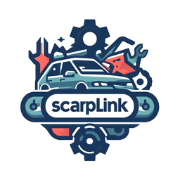

# Scraplink:

**Scraplink** is an open-source platform designed to revolutionize the way users access affordable automotive components. Whether you’re a car enthusiast, a mechanic, or someone looking to repair their vehicle, Scraplink offers a seamless experience.

## Features:
**User-Friendly Interface**: Scraplink provides an intuitive interface, making it easy for users to navigate and find the parts they need.

**Advanced Search Functionality**: Users can search for specific components, compare prices, and discover trusted dealers effortlessly.

**Sell Your Salvage Cars: Got a salvage car**? Scraplink allows users to offer their salvage vehicles to vendors, turning unused assets into cash.

## Motivation:
**Abundance of Salvageable Parts**: The automotive industry generates a wealth of salvageable parts. Scraplink aims to unlock this potential by connecting users with these valuable resources.

**Challenges in Finding Parts**: Locating the right spare parts can be daunting. Scraplink simplifies the process, saving users time and effort.

## Software Impacts:
**Cost Savings**: By accessing salvage parts, users can significantly reduce repair costs compared to buying new components.

**Environmental Sustainability**: Scraplink contributes to waste reduction by promoting the reuse of salvage parts, benefiting the environment.

**Support for Local Businesses**: Vendors on Scraplink are often local businesses, fostering community support.

**Convenience and Time Savings**: Advanced search features streamline the process, ensuring users find what they need efficiently.

## Contributing:
We welcome contributions! If you’d like to improve Scraplink, feel free to submit pull requests or open issues.

## License:
Scraplink is released under the **MIT License** by Hassan Ali Alkhelaif.
